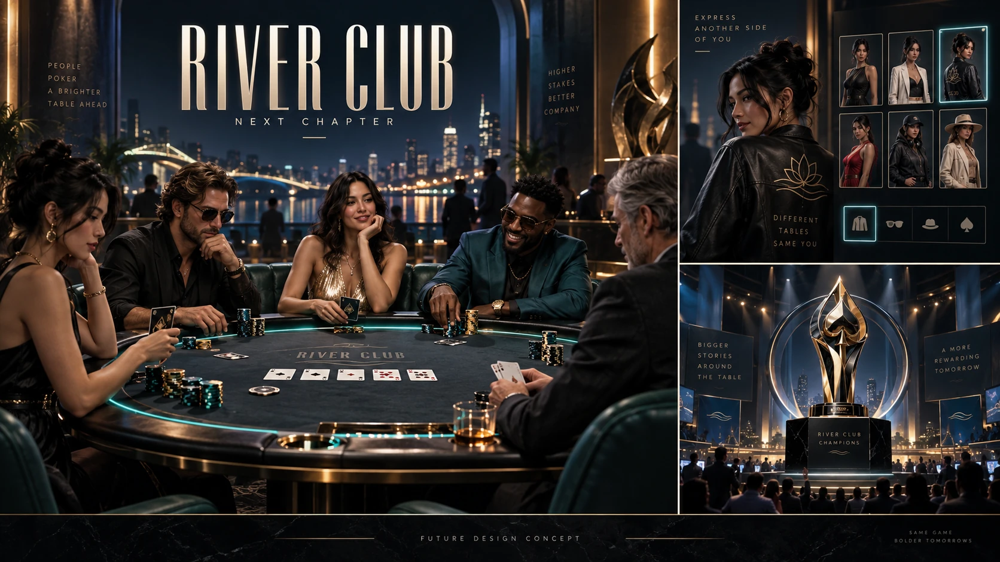

<div align="center">

# RIVER CLUB
### A place at the table.

**Version 2.2 · React + Vite · Four playable casino games · Solidity included**

</div>

## Start playing

```sh
npm install
npm run dev
```

Requires **Node 22.13+**. Runs on Windows, macOS and Linux. Open the local address printed by Vite. No wallet or API key is needed to play. Start with 10,000 free chips; use **+** beside the balance to refill.

## Optimized assets

Artwork and fonts are **78.4% smaller** in this edition. Transparent characters and screenshots use lossless WebP; backgrounds use high-quality WebP; fonts use WOFF2. Poker artwork loads on first entry. [Size report](docs/ASSET-OPTIMIZATION.md).

## Future-design book

Open **Design** in the navigation or visit **`/design`**. The eight-page concept PDF is optimized from 21.5 MB to 2.35 MB, encrypted at rest, decrypted in server RAM and rendered inside the app. Page navigation, zoom and mobile layouts are included.

The owner ZIP includes a private local key so `npm run dev` works immediately. Hosted deployment requires a server-only `DESIGN_PDF_KEY`; an optional `DESIGN_ACCESS_CODE` enables a private review form. **Deploy the frontend and API together.** [Setup and security boundaries](docs/DESIGN-VIEWER.md).

## Four tables. One club.

| Table | What is implemented |
|---|---|
| **Texas Hold’em** | Four seats, three bot personalities, three difficulty levels, equity simulations, pot-odds decisions, raises, rotating blinds, short-stack calls, side pots and hand history. |
| **Blackjack** | Dealer stands on soft 17, natural blackjack pays 3:2, split pairs, double down, step-by-step dealer draws and optional strategy hints. |
| **European roulette** | Animated single-zero wheel, straight numbers, red/black, odd/even, low/high, dozens and recent results. |
| **Baccarat** | Player/Banker/Tie bets, standard third-card rules, natural hands, 5% banker commission and animated reveals. |

The visual refresh includes an emerald-and-gold lobby, self-hosted typography, sculpted card and chip artwork, tactile felt tables, transparent character sprites, action poses and responsive mobile layouts. Character motion uses 2D poses and CSS; it is not a rigged 3D simulation.

**Also included:** character selection, XP, missions, daily rewards, simulated circuits, local parties and rooms, scripted social replies, demo escrow and a commit/reveal learning tool. [Read the feature guide](docs/DEMO.md).

## Build and verify

```sh
npm test
npm run contracts:compile
npm run build
npm run preview
```

The production build is written to `dist/`. Tests cover hand evaluation, betting, side pots, chip conservation, blackjack, roulette, baccarat and existing demo progression. Browser checks cover completed rounds, tab navigation and desktop/mobile layouts.

## Project map

- `src/components/game/` — lobby, character selection and four game interfaces.
- `src/lib/game/` — pure game engines, card evaluation, bot decisions and progression.
- `src/casino-premium.css` — new visual system and responsive table styling.
- `public/assets/` and `public/fonts/` — bundled artwork, character poses and licensed fonts.
- `contracts/` — Solidity attendance registry, setup guide and compiled artifacts.
- `tests/` — automated engine and demo tests.

## Web3 boundary

This is a **local play-money prototype**. There is no live multiplayer, real-money wagering, server account system or onchain dealing. The included [RiverEvents contract](contracts/RiverEvents.sol) records event attendance only; it does not custody bets or settle games. Configure an EVM wallet and contract address using the [contract guide](contracts/README.md) and `.env.example` to use that separate feature.

Completed progress and balances persist locally. Active rounds survive tab changes, but **refreshing or closing the browser abandons unfinished rounds and their reserved chips**. Refill chips freely in the demo. Local storage is editable and provides no security boundary.

## Future art direction



*Concept artwork, not an implemented screenshot.* Future work: rigged character animation, authoritative multiplayer, reconnectable rounds, tournament services and independently reviewed settlement. See [release notes](docs/CHANGELOG.md) for this delivery.
